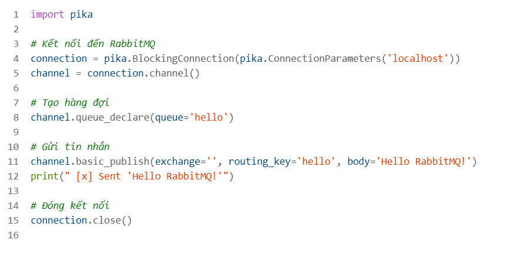
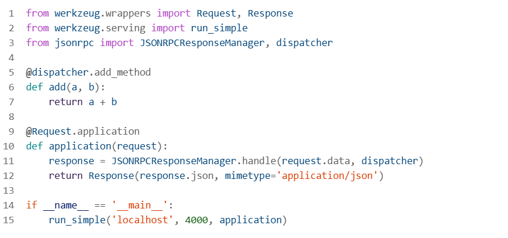

## Cơ chế và chức năng của RabbitMQ
RabbitMQ là một hệ thống môi giới tin nhắn mã nguồn mở, được sử dụng rộng rãi để quản lý giao tiếp giữa các ứng dụng. Nó hoạt động dựa trên giao thức Advanced Message Queuing Protocol (AMQP) và cung cấp các tính năng chính sau:  

- Message Queueing: RabbitMQ cho phép các ứng dụng gửi và nhận tin nhắn thông qua các hàng đợi. Tin nhắn được lưu trữ tạm thời trong hàng đợi cho đến khi được xử lý.
- Publish/Subscribe: RabbitMQ hỗ trợ mô hình publish/subscribe, cho phép một ứng dụng gửi tin nhắn đến nhiều ứng dụng khác.
Routing: RabbitMQ có khả năng định tuyến tin nhắn dựa trên các quy tắc định trước, giúp đảm bảo tin nhắn được gửi đến đúng người nhận.
- Reliability: RabbitMQ cung cấp các cơ chế đảm bảo độ tin cậy của tin nhắn, bao gồm xác nhận tin nhắn và lưu trữ tin nhắn bền vững  

## Code đơn giản sử dụng RabbitMQ

## Ngoài thư viện xmlrpc, có nhiều thư viện khác hỗ trợ RPC (Remote Procedure Call) với các tính năng và định dạng khác nhau.
Dưới đây là một số thư viện phổ biến:

- gRPC: Một thư viện RPC hiện đại, mã nguồn mở, hiệu suất cao, hỗ trợ nhiều ngôn ngữ như C++, Python, Ruby, Objective-C, PHP, và C#. gRPC sử dụng HTTP/2 để truyền dữ liệu và Protocol Buffers để mã hóa dữ liệu1.
- rpclib: Một thư viện RPC cho C++, cung cấp cả client và server. rpclib sử dụng msgpack để mã hóa dữ liệu và hỗ trợ các ngôn ngữ khác nhau 2 3.
- JSON-RPC: Một giao thức RPC đơn giản sử dụng định dạng JSON để mã hóa các yêu cầu và phản hồi. Có nhiều thư viện hỗ trợ JSON-RPC, bao gồm json-rpc cho Python 1.
- Thrift: Một framework RPC phát triển bởi Apache, hỗ trợ nhiều ngôn ngữ như Java, C++, Python, PHP, Ruby, Erlang, và Haskell. Thrift cho phép định nghĩa các dịch vụ và cấu trúc dữ liệu trong một file IDL (Interface Definition Language).
- MessagePack-RPC: Một thư viện RPC sử dụng MessagePack để mã hóa dữ liệu, hỗ trợ nhiều ngôn ngữ như C++, Python, Ruby, và JavaScript.  

Code ví dụ sử dụng thư viện json-rpc:  

